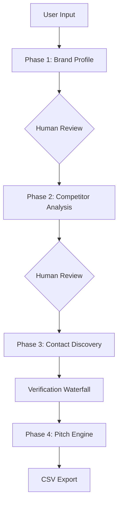

# B2B Prospect Intelligence Engine (Zero-Cost Edition v3.0)

[](https://www.python.org/)
[](https://opensource.org/licenses/MIT)
[](#)

A zero-cost, fully automated pipeline that transforms a raw company name into a verified, pitch-ready contact list.

## 🚀 Vision
The B2B Prospect Intelligence Engine abandons the traditional "spray-and-pray" model in favor of a strict **Human-in-the-Loop** architecture. It enforces user intervention to refine profiles before heavy data extraction begins.

## 🛠 Features
- **Phase 1: Brand Alignment** - Automated scraping and AI-driven profiling (Who/What/Why/How).
- **Phase 2: Competitor Calibration** - AI mapping of Tier A, B, and C competitors.
- **Phase 3: Contact Discovery** - Multi-stage verification waterfall (Apollo → Hunter → Pattern → SMTP).
- **Phase 4: Pitch Generation** - Personalized 3-touch pitch sequences for LinkedIn/Email.

## 🏗 Architecture


## 📋 Prerequisites
- Python 3.11+
- Groq API Key (Free Tier)
- Apollo.io & Hunter.io API Keys

## ⚙️ Setup
1. **Clone the repository:**
   ```bash
   git clone https://github.com/CapAmin22/Prospect_AI_Agent.git
   cd Prospect_AI_Agent
   ```

2. **Setup environment:**
   ```bash
   python -m venv venv
   source venv/bin/activate  # Windows: venv\\Scripts\\activate
   pip install -r requirements.txt
   playwright install chromium
   ```

3. **Configure API Keys:**
   Copy `.env.example` to `.env` and add your keys.

4. **Run the Engine:**
   ```bash
   python main.py "Target Company Name"
   ```

## 📄 License
This project is licensed under the MIT License - see the [LICENSE](LICENSE) file for details.
